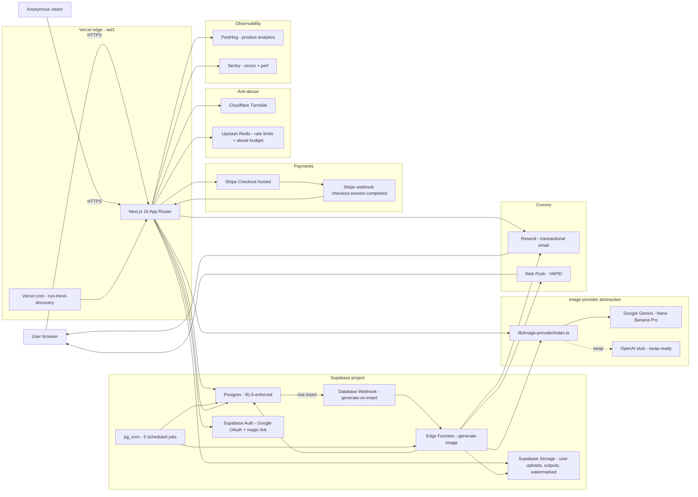
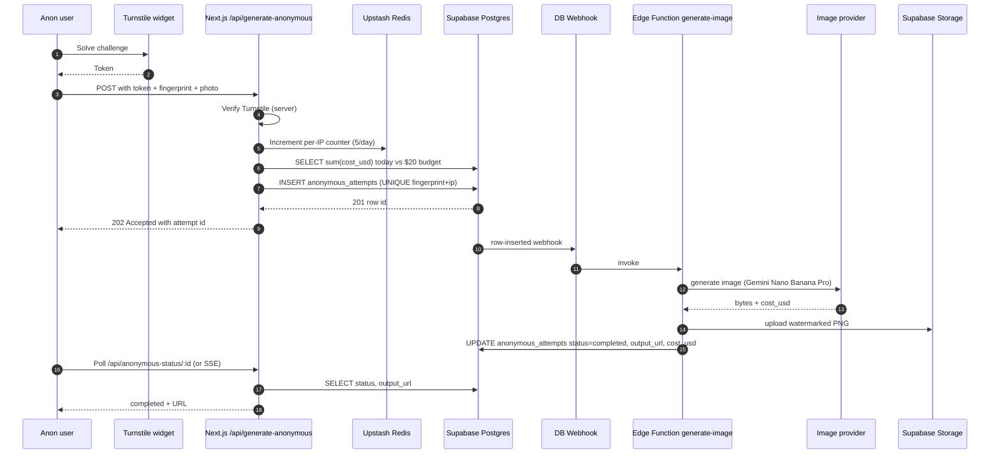
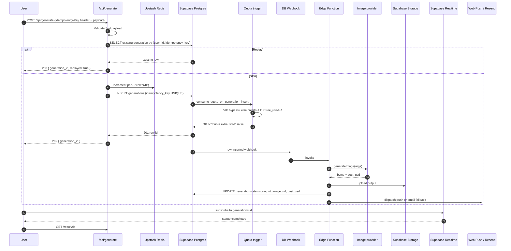
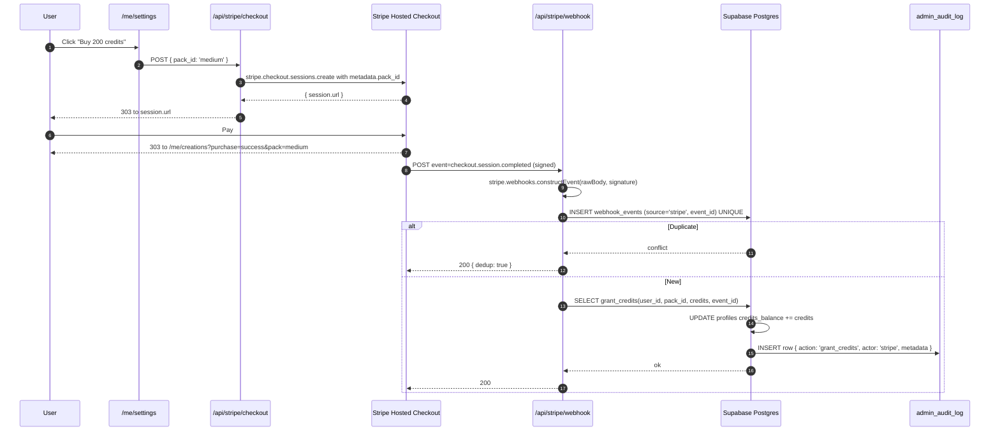

# Botdog — Architecture

**Last updated:** 2026-05-29
**Owner:** `balaji@kimp.xyz` (pre-acquisition)
**Audience:** Buyer's technical diligence team, then the buyer's engineering lead post-acquisition.

This is the single-page system map. Read this first, then drop into the linked ADRs / SOPs / runbook for depth. Everything here is current as of `main@HEAD` on 2026-05-29.

---

## At a glance

Botdog is a Next.js 16 App Router application deployed on Vercel, backed by a Supabase project that supplies Postgres + Auth + Storage + Edge Functions + `pg_cron`. The product turns a user-uploaded selfie into a LinkedIn-ready professional headshot — the user picks one of 14 profession styles from a style picker — by calling Google Gemini's Nano Banana 2 image model. Image generation runs out-of-band on a Supabase Edge Function triggered by a Database Webhook, so the user-facing API responds in <1s while the actual model call (5-30s) happens asynchronously and the result page polls/subscribes for completion.

Payment is one-time **credit packs** (no subscription) sold through Stripe Checkout — three SKUs at $4.99 / $14.99 / $39.99 (50 / 200 / 600 credits). The free tier is **5 generations per week**, refilled by a `pg_cron` job every Sunday at 00:00 UTC. The anonymous trial gives **one** generation per `(fingerprint_hash, ip_hash)` pair, ever, with a global $20/day cost ceiling enforced server-side.

Image generation goes through a **provider abstraction** (`lib/image-provider/index.ts`) — Gemini is the default, OpenAI is wired as a stub. Switching providers is a one-env-var change (`IMAGE_PROVIDER=openai`), which is the single biggest piece of vendor-lock insurance the buyer inherits.

The supporting cast: **Resend** for transactional email (magic-link sign-in + push-fallback "your image is ready"), **Cloudflare Turnstile** for bot defence on signup and the anonymous endpoint, **Upstash Redis** for per-IP rate limits (20 gen/hr/IP) and the anonymous abuse budget, **PostHog** for product analytics (15-event funnel), **Sentry** for errors + perf, and **Web Push (VAPID)** for completion notifications with email fallback when the subscription has expired.

The whole thing runs comfortably under $50/mo at MVP scale — see [Infra cost shape](#infra-cost-shape) below.

---

## System diagram



**How to read it:**

- Solid arrows = production traffic.
- Dotted arrow (`-.swap.->`) = provider abstraction; the OpenAI implementation exists but is not the default.
- `PG -->|row insert| Webhook` is the load-bearing async-handoff: the user-facing `/api/generate` returns as soon as the row is inserted; the Edge Function does the slow work.

---

## Request lifecycle

The four critical flows. Each is a Mermaid sequence diagram you can read top-to-bottom.

### (1) Anonymous trial → result

The "free taste" path. One per `(fingerprint_hash, ip_hash)` lifetime; $20/day global abuse budget.



Source: `app/api/generate-anonymous/route.ts`, `supabase/functions/generate-image/index.ts`, ADR 7.

### (2) Signup with Google OAuth

ToS acceptance + UTM capture happen in the callback, before the redirect.

```mermaid
sequenceDiagram
    autonumber
    participant U as User
    participant App as Next.js /login
    participant SB as Supabase Auth
    participant G as Google OAuth
    participant CB as Next.js /auth/callback
    participant DB as Supabase Postgres

    U->>App: GET /login
    App-->>U: Render login (Turnstile-gated)
    U->>App: Click "Continue with Google" (server action)
    App->>SB: signInWithOAuth provider=google
    SB-->>U: 302 to accounts.google.com
    U->>G: Consent
    G-->>U: 302 to https://&lt;ref&gt;.supabase.co/auth/v1/callback
    SB-->>U: 302 to /auth/callback?code=...
    U->>CB: GET /auth/callback?code=...
    CB->>SB: exchangeCodeForSession(code)
    SB-->>CB: session + access_token
    CB->>DB: UPDATE profiles SET tos_accepted_at=now(), acquisition_source=&lt;utm cookies&gt; WHERE id=auth.uid()
    CB-->>U: 302 to /
```

Source: `app/auth/callback/route.ts`, migration `20260529000001_tos_acceptance.sql`, migration `20260529000003_profiles_acquisition_source.sql`.

### (3) Authenticated generation

Idempotency-Key required. Quota enforced by trigger. Result page reads via Realtime + polling fallback.



Source: `app/api/generate/route.ts`, `supabase/migrations/20260527000003_generations.sql`, `supabase/functions/generate-image/index.ts`, ADRs 2 + 5.

### (4) Stripe checkout → credit grant

Webhook idempotency via `webhook_events.event_id UNIQUE`. Credit grant via `grant_credits()` `SECURITY DEFINER`, audited.



Source: `app/api/stripe/checkout/route.ts`, `app/api/stripe/webhook/route.ts`, `supabase/migrations/20260528000001_grant_credits.sql`, ADR 5.

---

## Data model overview

Every user-facing table has RLS on. Service-role client (`createServiceClient()` in `lib/supabase/server.ts`) is the only consumer that bypasses, and is used only by trusted server-side code paths (webhook, Edge Function dispatch, admin actions). Migration files are dated `YYYYMMDD000N`.

| Table                   | Purpose                                                                                                                                                                                                                          | RLS posture                                                                                                               | Origin migration                                                                                                                                                                                                   |
| ----------------------- | -------------------------------------------------------------------------------------------------------------------------------------------------------------------------------------------------------------------------------- | ------------------------------------------------------------------------------------------------------------------------- | ------------------------------------------------------------------------------------------------------------------------------------------------------------------------------------------------------------------ |
| `profiles`              | User row keyed to `auth.uid()`. Holds `credits_balance`, `free_used_this_week`, `bonus_credits_earned`, `deleted_at`, `tos_accepted_at`, `acquisition_source`, `first_purchase_discount_used_at`, `is_vip`, `push_subscription`. | Own row read/update. Soft-deleted rows filtered out. `tos_accepted_at` protected from being cleared.                      | `20260527000001_profiles.sql` + `20260529000001_tos_acceptance.sql` + `20260529000003_profiles_acquisition_source.sql` + `20260529000004_profiles_first_purchase_discount.sql` + `20260529000006_profiles_vip.sql` |
| `trends`                | Catalog of generatable styles. Holds `slug`, `prompt_template`, `input_schema jsonb` (drives dynamic forms), `eval_status`, `is_active`, `share_caption`, lifecycle counters.                                                    | Public read where `is_active=true`. Admin-only write. CHECK constraint: `is_active=true` requires `eval_status='passed'`. | `20260527000002_trends.sql` + `20260529000005_trends_share_caption.sql` + `20260529000008_trends_lifecycle.sql`                                                                                                    |
| `generations`           | Every image generation attempt. Holds `idempotency_key UNIQUE`, `status`, `output_image_url`, `cost_usd`, `attempts`, `purge_at`, `is_favorite`, `search_text`.                                                                  | Own row read; insert/update gated by quota trigger; service-role write on Edge Function completion.                       | `20260527000003_generations.sql` + `20260529000007_generations_favorites_search.sql` + `20260529000009_quota_trigger_vip_and_alert.sql`                                                                            |
| `anonymous_attempts`    | One row per anonymous trial. `(fingerprint_hash, ip_hash) UNIQUE` enforces the lifetime cap.                                                                                                                                     | Service-role only. Purged after 14d by pg_cron.                                                                           | `20260527000004_ancillary.sql` + ADR 7                                                                                                                                                                             |
| `referrals`             | `referrer_id`, `referred_id`, `status`. Reward trigger fires when referee's first generation completes.                                                                                                                          | Own referrals read; service-role write.                                                                                   | `20260527000004_ancillary.sql`                                                                                                                                                                                     |
| `webhook_events`        | Stripe (and future provider) event log. `(source, event_id) UNIQUE` is the idempotency key.                                                                                                                                      | Service-role only.                                                                                                        | `20260527000004_ancillary.sql`                                                                                                                                                                                     |
| `admin_audit_log`       | Append-only record of every admin write + every credit grant. Written via `logAdminAction()` and the `grant_credits` `SECURITY DEFINER`.                                                                                         | Admin read; insert via trigger / definer functions only. Immutable.                                                       | `20260527000004_ancillary.sql` + `20260528000001_grant_credits.sql`                                                                                                                                                |
| `admin_users`           | `(user_id, role)`. Seed `admin` role for `/admin/*` access.                                                                                                                                                                      | Self read; admin-only write.                                                                                              | `20260527000004_ancillary.sql`                                                                                                                                                                                     |
| `trend_events`          | Impression / view counter per trend (used for cold-trend auto-deactivate).                                                                                                                                                       | Service-role write; admin read.                                                                                           | `20260529000002_trend_events.sql`                                                                                                                                                                                  |
| `trend_eval_inputs`     | Eval-suite fixture images per trend.                                                                                                                                                                                             | Admin read/write.                                                                                                         | `20260527000002_trends.sql`                                                                                                                                                                                        |
| `trend_eval_runs`       | Per-run eval result rows that gate `is_active`.                                                                                                                                                                                  | Admin read/write.                                                                                                         | `20260527000002_trends.sql`                                                                                                                                                                                        |
| `trend_suggestions`     | Auto-detector inbox (Phase 6) + user suggestions.                                                                                                                                                                                | User insert; admin read/triage.                                                                                           | `20260527000004_ancillary.sql`                                                                                                                                                                                     |
| `admin_marketing_spend` | Monthly UTM-sourced spend for CAC math.                                                                                                                                                                                          | Admin only.                                                                                                               | `20260529000011_admin_marketing_spend.sql`                                                                                                                                                                         |

Tables referenced in the plan but **not yet shipped**: `collections`, `notifications`, `gift_codes`, `content_reports`. The schemas are in [.claude/todo.md](../.claude/todo.md) post-MVP backlog. Buyer should treat them as planned-but-not-built, not present-but-unused.

Storage buckets (from `20260528000002_storage_buckets.sql`):

| Bucket                    | Public  | Purpose                                              |
| ------------------------- | ------- | ---------------------------------------------------- |
| `uploads`                 | private | User-supplied source photos. Signed URLs only.       |
| `generations`             | public  | Pro-tier full-res outputs. Public so OG images work. |
| `generations-watermarked` | public  | Free-tier watermarked outputs.                       |
| `trend-thumbnails`        | public  | Admin-curated thumbnails shown on the trend grid.    |

---

## Key invariants

These are the load-bearing guarantees. Breaking any one of them produces a sev-1 incident.

- **RLS quota enforcement at the trigger layer (ADR 2).** Every `INSERT` into `generations` runs `consume_quota_on_generation_insert`. If `free_used_this_week >= 5 AND credits_balance <= 0 AND is_vip = false`, the insert raises `quota exhausted`. The API layer cannot bypass — the DB owns the invariant.
- **VIP bypass (`profiles.is_vip = true`)** short-circuits the quota check but still records `cost_usd` so unit economics math stays honest. Source: `20260529000009_quota_trigger_vip_and_alert.sql`.
- **Eval gate (ADR 4):** `is_active = true` requires `eval_status = 'passed'`. A CHECK constraint enforces this, and a trigger flips `is_active = false` whenever `prompt_template` changes (so prompt edits force a re-eval). Source: `20260527000002_trends.sql`.
- **Idempotency-Key required on `/api/generate` (ADR 5):** server returns `400` if missing. Duplicate `(user_id, idempotency_key)` returns the original `generation_id` with `replayed: true` — Gemini is called exactly once.
- **Stripe webhook dedup:** `webhook_events.event_id` is unique per source. A replayed event hits the conflict, the credit grant short-circuits, the response is `200 { dedup: true }`.
- **Soft-delete + 30d purge (ADR 6):** `profiles.deleted_at` is set on user-initiated delete. RLS filters soft-deleted users immediately. `pg_cron` job `purge_soft_deleted_profiles` runs daily; rows older than 30d are hard-deleted with `ON DELETE CASCADE` propagating to `generations`, `referrals`, etc.
- **Anonymous trial (ADR 7):** `anonymous_attempts (fingerprint_hash, ip_hash) UNIQUE` guarantees one attempt per device-pair. The endpoint also checks the global daily sum: if `SUM(cost_usd) WHERE created_at > now() - interval '1 day' >= ANONYMOUS_DAILY_BUDGET_USD`, the endpoint returns 503 until the next UTC day.
- **ToS acceptance:** `profiles.tos_accepted_at` is stamped on first `/auth/callback` execution. RLS prevents the user from clearing it via the profile-update path (they can soft-delete but not un-accept ToS).
- **Auto-deactivate cold trends:** trends with `< N` views in 7 rolling days get `is_active = false`, except during a 14-day cold-start grace window after creation. Source: `20260529000008_trends_lifecycle.sql` + `20260529000010_pg_cron_auto_deactivate.sql`.

---

## Scaling notes

What breaks at scale, and when.

**10x current MVP load (~1k MAU → ~10k MAU):**

- Nothing structural breaks. The bottleneck is **Edge Function cold starts** — Supabase Edge Functions on the Free / Pro tiers have a ~150-500ms cold-start tax that dominates user-perceived latency on infrequently-hit functions. Mitigation: the function is hit on every generation, so it stays warm during active hours; the cold-start is mainly felt by the first user of the day in EU/APAC.
- Gemini cost-per-image scales linearly. The unit economics (`$0.03-0.05 per image at Nano Banana Pro` retail vs `$0.067-0.10 per credit retail`) hold; gross margin stays in the 50-70% range.
- Stripe webhook throughput is fine — `checkout.session.completed` arrives at <1 event/sec at 10k MAU.

**100x (~100k MAU):**

- `trend_events` table grows fast — every impression writes a row. At 100k MAU with ~10 impressions/session, that's ~1M rows/day. Migrate to a materialized view (impression-rollup per trend per day) with a nightly refresh; keep `trend_events` for the last 30 days and partition / archive older rows.
- Stripe webhook backlog risk if traffic spikes (e.g., viral TikTok). Current architecture handles ~1000 req/sec from Stripe assuming no IPC bottleneck — Vercel function `maxDuration: 30` keeps individual webhook calls bounded, and the dedup is O(1) on the unique index.
- Supabase Postgres `db.t3.medium` (default on Pro) starts hurting at ~1000 concurrent connections. PgBouncer is enabled by default; the next step is upgrading to a `db.r5.large` and adding read replicas for the trend-page SSR reads.
- Edge Function concurrency cap (Supabase Pro: 1000 concurrent invocations) becomes the next ceiling. Mitigation: chunk Gemini calls or move the heavy generation to a dedicated worker queue (BullMQ on Upstash, or AWS SQS + Lambda).

**1000x (~1M MAU):**

- Architecture starts to genuinely strain. Plan would be to split `generations` into hot (last 30 days) + cold (S3 Parquet exports queried via Athena), move trend-page SSR reads behind a CDN cache + edge config, and adopt a dedicated CDN-bucket for Storage. Stripe + Resend remain happy at this scale; Gemini API quota becomes the operational gate.

The buyer should plan to revisit scaling at the 50k MAU mark — none of the above is urgent below that.

---

## Security posture

- **Response headers** (set in `next.config.ts`):
  - `Strict-Transport-Security: max-age=63072000; includeSubDomains; preload`
  - `X-Content-Type-Options: nosniff`
  - `X-Frame-Options: DENY`
  - `Referrer-Policy: strict-origin-when-cross-origin`
  - `Permissions-Policy: camera=(), microphone=(), geolocation=(), interest-cohort=(), browsing-topics=()`
  - `X-DNS-Prefetch-Control: on`
- **CSP is intentionally omitted** until the Stripe + Turnstile + Google OAuth iframe origins are live and verified. Shipping a too-strict policy now would silently break working features. Tracked in [.claude/todo.md](../.claude/todo.md) under "post-MVP hygiene".
- **RLS on every user-facing table.** Service-role bypass only via `createServiceClient()` in `lib/supabase/server.ts`. Audit: every call site is in `app/api/`, the Edge Function, or admin server actions — never in client components.
- **Turnstile gates:** signup form (`app/(auth)/login/LoginForms.tsx`) and the anonymous generation endpoint. Both server-verify the token in `lib/turnstile/verify.ts`.
- **Idempotency:** `/api/generate` (header-driven) and `/api/stripe/webhook` (`webhook_events.event_id` UNIQUE).
- **PII handling:** SHA-256 hash before logging fingerprints (`lib/anonymous/fingerprint.ts`) and IP addresses (`lib/rate-limit.ts`). Sentry `beforeSend` scrubs request bodies; the email-mask helper in `lib/email/send.ts` replaces the local part with `***` before any error report containing an email is sent.
- **GDPR posture:**
  - 30-day soft-delete + hard-delete cascade (ADR 6).
  - Export endpoint at `/api/me/export` returns the user's `profiles` + `generations` rows as JSON + a ZIP of their outputs.
  - Cookie consent banner before any non-essential cookie is set (`components/legal/CookieConsent.tsx`).
- **Audit log:** every admin write goes through `logAdminAction()`, which inserts into `admin_audit_log` via a `SECURITY DEFINER` function. Rows are immutable (no UPDATE / DELETE policy granted to anyone, not even `service_role`).
- **Image upload SSRF defence:** `next.config.ts` `images.remotePatterns` allowlists only Supabase Storage + Unsplash + Imgix. Wildcard hosts would turn `/_next/image` into an open proxy against internal metadata endpoints — this is intentionally locked down.
- **Webhook signature verification:** Stripe events are verified with `stripe.webhooks.constructEvent(rawBody, signature, secret)`. The raw-body handling means `app/api/stripe/webhook` is **excluded** from Supabase middleware in `proxy.ts`.

---

## Infra cost shape

Monthly USD, MVP scale (≤ 5k MAU). All numbers are public-tier pricing as of 2026-05-29 — buyer should re-verify before committing to a number in due diligence.

| Service                  | Free tier covers                            | Cost beyond free                                             | MVP run-rate |
| ------------------------ | ------------------------------------------- | ------------------------------------------------------------ | ------------ |
| Vercel                   | Hobby tier supports MVP traffic             | Pro tier $20/mo when bandwidth or build minutes exceed Hobby | $0-$20/mo    |
| Supabase                 | Free tier: 50k MAU + 500MB DB + 1GB Storage | Pro tier $25/mo for higher caps + daily backups + better SLA | $0-$25/mo    |
| Gemini (Nano Banana Pro) | Pay-per-call ~$0.03-0.05 per image          | Variable; ~$30-$50/mo at 1000 generations/mo                 | $30-$50/mo   |
| Resend                   | 3000 emails/mo free                         | $20/mo for 50k                                               | $0/mo        |
| PostHog                  | 1M events/mo free                           | $0.00031/event beyond                                        | $0/mo        |
| Sentry                   | 5k errors/mo + 10k perf transactions free   | Team plan $26/mo for 50k errors                              | $0/mo        |
| Cloudflare Turnstile     | Unlimited free                              | n/a                                                          | $0           |
| Upstash Redis            | 10k commands/day free                       | Pay-as-you-go beyond                                         | $0/mo        |
| Domain                   | n/a                                         | ~$15/year                                                    | $1.25/mo     |
| **Total at MVP**         |                                             |                                                              | **<$50/mo**  |

The dominant cost line is Gemini, which is also directly margin-coupled — every dollar spent there underpins ~$3 of revenue at the 200-credit pack price. Vercel + Supabase Pro upgrades become worthwhile around 5k-10k MAU.

---

## Deploy + ops

### CI/CD

GitHub Actions runs the static gates on every push:

- `pnpm install --frozen-lockfile`
- `pnpm typecheck`
- `pnpm lint`
- `pnpm test` (Vitest, currently 283 tests)
- `pnpm build`

PRs that fail any of these are blocked. The workflow file is `.github/workflows/ci.yml`. Playwright E2E runs on a manual-dispatch workflow and on the nightly schedule (`agent-browser` smoke).

### Vercel

Production deploys via the GitHub integration on every push to `main`. Preview deploys auto-generated per PR. Region: `iad1` (US East). Function timeouts pinned in `vercel.json`:

| Route                                        | maxDuration |
| -------------------------------------------- | ----------- |
| `app/api/generate/route.ts`                  | 60s         |
| `app/api/generate-anonymous/route.ts`        | 60s         |
| `app/api/stripe/webhook/route.ts`            | 30s         |
| `app/api/push/dispatch/route.ts`             | 30s         |
| `app/api/me/export/route.ts`                 | 60s         |
| `app/api/download/[id]/route.ts`             | 30s         |
| `app/api/admin/run-trend-discovery/route.ts` | 60s         |

Defaults to 10s for any route not listed.

### Supabase

Migrations applied via `pnpm supabase db push --linked` **before** the Vercel deploy that consumes them. The linked project ref lives in `supabase/.temp/project-ref` (gitignored). Migration drift checked via `pnpm supabase:diff`.

### Edge Function

Deployed separately from the Next.js build:

```
pnpm supabase functions deploy generate-image --no-verify-jwt --project-ref <ref>
```

Secrets (`GEMINI_API_KEY`, `SITE_URL`) are set via `pnpm supabase secrets set`. They live independently of Vercel env vars — the Edge Function runs inside Supabase, not Vercel.

### Database Webhook

Configured once in the Supabase Dashboard → Database → Webhooks. Trigger: `INSERT on public.generations`. Target: the deployed `generate-image` Edge Function. Configuration is a one-time UI action; no code-driven setup.

### `pg_cron` jobs

Defined in migrations, not externally orchestrated. Current jobs:

| Job                             | Schedule             | Migration                                    |
| ------------------------------- | -------------------- | -------------------------------------------- |
| `reset_free_weekly`             | Sunday 00:00 UTC     | `20260527000005_pg_cron.sql`                 |
| `purge_expired_anonymous`       | daily 03:00 UTC      | `20260527000005_pg_cron.sql`                 |
| `purge_expired_generations`     | daily 03:15 UTC      | `20260527000005_pg_cron.sql`                 |
| `purge_soft_deleted_profiles`   | daily 03:30 UTC      | `20260527000005_pg_cron.sql`                 |
| `auto_deactivate_cold_trends`   | daily 04:00 UTC      | `20260529000010_pg_cron_auto_deactivate.sql` |
| `run_trend_discovery` (Phase 6) | weekly Mon 08:00 UTC | `20260529000012_pg_cron_trend_discovery.sql` |

### Vercel cron

`vercel.json` `crons[]` entries (one as of 2026-05-29):

| Path                             | Schedule          |
| -------------------------------- | ----------------- |
| `/api/admin/run-trend-discovery` | Mondays 08:00 UTC |

This duplicates the `pg_cron` Phase 6 job on purpose: the Vercel cron invokes the API route which orchestrates the LLM proposer, while the pg_cron version is a fallback for when the API route is degraded.

---

## Where to read more

- **ADRs** (`docs/adr/*`) — the seven locked decisions:
  - [ADR 1 — One-time credit packs as the launch monetization model](./adr/0001-credit-packs-vs-subscription.md)
  - [ADR 2 — Free-tier quota enforced at the Postgres trigger layer](./adr/0002-rls-quota-strategy.md)
  - [ADR 3 — Schema-driven trend input forms via `trends.input_schema jsonb`](./adr/0003-schema-driven-trend-inputs.md)
  - [ADR 4 — `is_active=true` requires `eval_status='passed'` enforced at DB layer](./adr/0004-eval-gate-constraint.md)
  - [ADR 5 — Client-supplied `Idempotency-Key` header on `/api/generate`](./adr/0005-idempotency-strategy.md)
  - [ADR 6 — Soft-delete via `profiles.deleted_at` with 30-day pg_cron purge](./adr/0006-soft-delete-cascade.md)
  - [ADR 7 — Anonymous trial gated by fingerprint+IP UNIQUE plus daily abuse budget](./adr/0007-anonymous-trial-architecture.md)

- **Operations**
  - [`docs/RUNBOOK.md`](./RUNBOOK.md) — per-credential onboarding + 14-test verification matrix.
  - [`docs/CREDENTIALS.md`](./CREDENTIALS.md) — every env var, what it unlocks, what breaks if missing.
  - [`docs/LAUNCH_CHECKLIST.md`](./LAUNCH_CHECKLIST.md) — pre-deploy go/no-go list.
  - [`docs/sops/daily_ops.md`](./sops/daily_ops.md) — daily founder checklist.
  - [`docs/sops/new_trend_weekly.md`](./sops/new_trend_weekly.md) — weekly content cadence.
  - [`docs/sops/refund_request.md`](./sops/refund_request.md) — refund handling SOP.
  - [`docs/sops/takedown.md`](./sops/takedown.md) — IP / DMCA takedown SOP.
  - [`docs/sops/incident_response.md`](./sops/incident_response.md) — sev-1 / sev-2 playbook.

- **Legal + transferability**
  - [`docs/TERMS_OF_SERVICE.md`](./TERMS_OF_SERVICE.md)
  - [`docs/PRIVACY_POLICY.md`](./PRIVACY_POLICY.md)
  - [`docs/legal/SUB_PROCESSORS.md`](./legal/SUB_PROCESSORS.md)
  - [`docs/legal/DPA_TEMPLATE.md`](./legal/DPA_TEMPLATE.md)
  - [`docs/transferability/per-account-transfer-plan.md`](./transferability/per-account-transfer-plan.md)
  - [`docs/transferability/post-acquisition-timeline.md`](./transferability/post-acquisition-timeline.md)

- **Data room index** — [`docs/data-room/README.md`](./data-room/README.md).
- **Incidents log** — [`docs/incidents/README.md`](./incidents/README.md).
